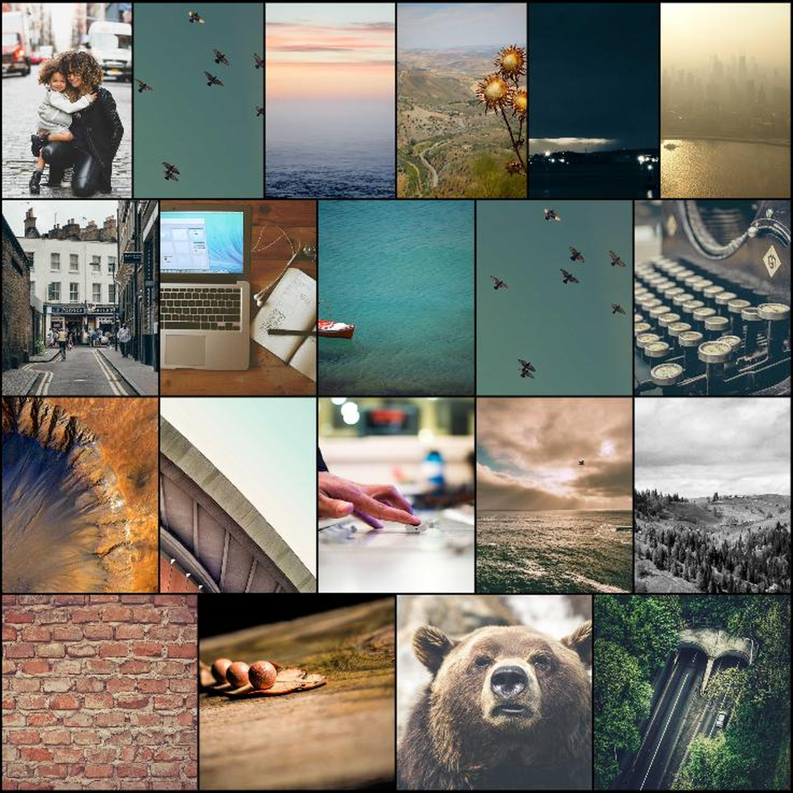

# DSPLAY - Photo Collage Template

A [React](https://reactjs.org/) [HTML-based template](https://developers.dsplay.tv/docs/html-templates) for the [DSPLAY - Digital Signage](https://dsplay.tv/) platform — lays out a full-screen justified photo grid from the current media source.

> Built with [Vite](https://vitejs.dev/), requires Node.js 22.22.2+, 24.15.0+, or 26+ (see `.nvmrc`).

## Supported screen formats

| Landscape | Portrait | Square |
|-----------|----------|--------|
|  |  |  |

| Horizontal banner | Vertical banner |
|--------------------|-------------------|
|  |  |

## Template variables

| Key      | Type    | Description                                                          |
|----------|---------|------------------------------------------------------------------------|
| `random` | boolean | Shuffles the image order when `true`. Defaults to the original order. |
| `margin` | integer | Pixel gap between images in the grid. Defaults to `0`.                |

> Remember to also register these as Template Vars (same name and type) when configuring this template in the DSPLAY CMS.

> New variable names should use `snake_case` (e.g. `background_color`, not `backgroundColor`) — the DSPLAY CMS Manager auto-generates each variable's label from its key, and snake_case reads more naturally there.

The images themselves are **not** a Template Var — they come from the DSPLAY media source configured for this template instance (`dsplay_media.images`, a plain URL array, and/or a connected social/Instagram-style source's `result.data.posts[].media[]`), not from `dsplay_data.js`'s `dsplay_template` object.

## Local development

```sh
npm install
npm start
```

`public/dsplay-data.js` defines `dsplay_config`/`dsplay_media`/`dsplay_template` mock globals used only when the template isn't running inside the actual DSPLAY app. Edit `dsplay_media.images` to try out a different set of photos — the DSPLAY Player App replaces it with the real media source at runtime.

## Packing (release build)

```sh
npm run zip
```

This builds the template with Vite, which also generates `template-variables.json` + `template-example-data.json` (via [@dsplay/template-manifest](https://www.npmjs.com/package/@dsplay/template-manifest)'s Vite plugin) — the DSPLAY CMS reads these two files to auto-detect this template's variables and seed default preview values. It then generates `template.zip`, ready to be deployed to the [DSPLAY Web Manager](https://manager.dsplay.tv/template/create).

## Test assets

To use test assets (images, videos, etc) during development, put them in the `public/test-assets` folder and reference them in `dsplay-data.js` using their relative path. `public/test-assets` is automatically excluded from the release build.

## Maintaining dependencies

Regular npm dependencies, not vendored files:

```sh
npm outdated
npm update
```

For a version outside the declared range (typically a major bump), apply it deliberately and verify `npm start`, `npm run build`, and `npm test` still work before committing.

### Commit conventions

See [AGENTS.md](AGENTS.md).

## More

To see more about DSPLAY HTML Templates, visit: https://developers.dsplay.tv/docs/html-templates
